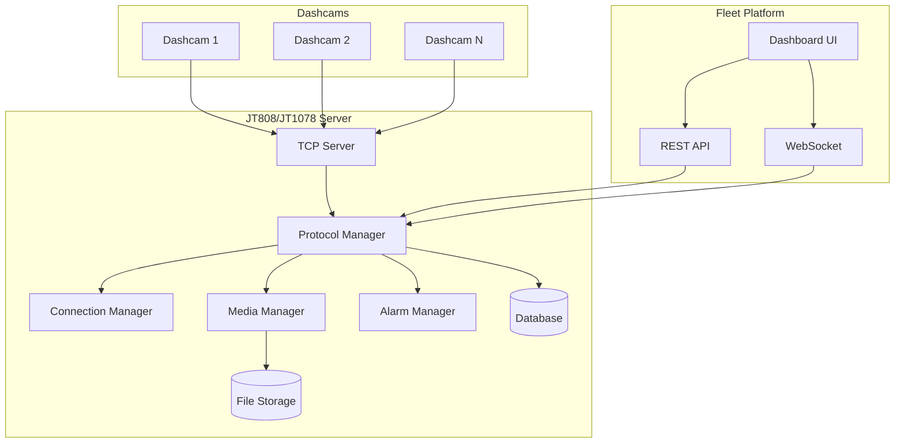

# Design Document

## Overview

The JT808/JT1078 Dashcam Server is a Node.js-based middleware solution that implements both JT808 (GPS tracking and command) and JT1078 (multimedia streaming) protocols. The server acts as a bridge between Chinese-manufactured dashcams and a custom fleet management platform, providing real-time GPS tracking, multimedia handling, two-way communication, and remote device management capabilities.

### Key Design Principles

- **Protocol Compliance**: Full implementation of JT808 and JT1078 protocol specifications
- **Scalability**: Support for multiple concurrent dashcam connections
- **Real-time Processing**: Low-latency handling of GPS data, alarms, and media streams
- **Reliability**: Robust error handling and connection management
- **Security**: Device authorization and secure communication channels
- **Modularity**: Clean separation of concerns for maintainability

## Architecture

### High-Level Architecture



### Core Components

1. **TCP Server**: Handles raw socket connections from dashcams
2. **Protocol Manager**: Parses and processes JT808/JT1078 messages
3. **Connection Manager**: Manages device sessions and heartbeats
4. **Media Manager**: Handles video/audio streaming and file operations
5. **Alarm Manager**: Processes and distributes alarm notifications
6. **Database Layer**: Stores device data, locations, and metadata
7. **API Layer**: Provides REST and WebSocket interfaces
8. **File Storage**: Manages multimedia files and recordings

## Components and Interfaces

### 1. TCP Server Component

**Purpose**: Handle raw TCP socket connections and data streams from dashcams.

**Key Responsibilities**:

- Accept incoming TCP connections on configured port
- Maintain persistent connections with dashcams
- Handle connection lifecycle (connect, disconnect, timeout)
- Buffer and forward raw data to Protocol Manager

**Interface**:

```javascript
class TCPServer {
  constructor(port, options)
  start()
  stop()
  getConnections()
  broadcastToDevice(deviceId, data)
  closeConnection(deviceId)
}
```

### 2. Protocol Manager Component

**Purpose**: Parse and process JT808/JT1078 protocol messages.

**Key Responsibilities**:

- Parse binary protocol messages
- Validate message structure and checksums
- Route messages to appropriate handlers
- Generate protocol-compliant responses
- Handle message sequencing and acknowledgments
- Detect and log protocol version compatibility

**Protocol Detection & Compatibility**:

- Auto-detect JT808 version (2011/2013/2019) from message structure and reserved fields
- Auto-detect JT1078 version (2013/2016) from media packet headers and data format
- Log protocol version mismatches with detailed information
- Support backward compatibility where possible
- Reject unsupported protocol versions with informative error messages

**Message Handlers**:

- `0x0100`: Terminal Registration
- `0x0002`: Heartbeat
- `0x0200`: Location Report
- `0x0704`: Batch GPS Report
- `0x0800/0x0301`: Multimedia Events
- `0x9101/0x9201`: JT1078 Media Packets

**Interface**:

```javascript
class ProtocolManager {
  parseMessage(buffer, deviceId)
  detectProtocolVersion(buffer)
  validateProtocolCompatibility(version, deviceId)
  handleRegistration(message, deviceId)
  handleHeartbeat(message, deviceId)
  handleLocationReport(message, deviceId)
  handleMediaPacket(message, deviceId)
  sendCommand(deviceId, commandType, data)
  logProtocolMismatch(deviceId, detectedVersion, supportedVersion)
}
```

### 3. Connection Manager Component

**Purpose**: Manage device sessions, authentication, and connection state.

**Key Responsibilities**:

- Authenticate devices against authorized database
- Track connection status and heartbeat timing
- Manage device sessions and metadata
- Handle connection cleanup and resource management

**Interface**:

```javascript
class ConnectionManager {
  registerDevice(deviceId, registrationData)
  isDeviceAuthorized(deviceId)
  updateHeartbeat(deviceId)
  getDeviceStatus(deviceId)
  getConnectedDevices()
  disconnectDevice(deviceId)
}
```

### 4. Media Manager Component

**Purpose**: Handle JT1078 multimedia streaming and file operations.

**Key Responsibilities**:

- Process JT1078 media packets (0x9101, 0x9201)
- Reassemble H.264 video frames
- Handle audio stream processing
- Manage file storage and retrieval
- Support real-time streaming via WebSocket/RTMP

**Interface**:

```javascript
class MediaManager {
  processMediaPacket(packet, deviceId)
  startVideoStream(deviceId, channelId)
  stopVideoStream(deviceId)
  saveMediaFile(deviceId, mediaData, metadata)
  getStoredMedia(deviceId, filters)
  streamToWebSocket(deviceId, wsConnection)
}
```

### 5. Alarm Manager Component

**Purpose**: Process alarm events and distribute notifications.

**Key Responsibilities**:

- Parse alarm data from JT808 messages
- Classify alarm severity and type
- Trigger immediate notifications for critical alarms
- Log alarm events with context
- Integrate with notification systems

**Interface**:

```javascript
class AlarmManager {
  processAlarm(alarmData, deviceId)
  classifyAlarmSeverity(alarmType)
  sendAlarmNotification(alarm, recipients)
  getAlarmHistory(deviceId, timeRange)
}
```

## Data Models

### Device Model

```javascript
{
  deviceId: String,           // Unique device identifier
  imei: String,              // Device IMEI
  phoneNumber: String,       // SIM card number
  registrationTime: Date,    // First registration timestamp
  lastHeartbeat: Date,       // Last heartbeat received
  status: String,            // online, offline, registered
  firmware: String,          // Device firmware version
  authorized: Boolean,       // Authorization status
  settings: {                // Device configuration
    serverIp: String,
    serverPort: Number,
    reportInterval: Number,
    hotspotConfig: Object
  }
}
```

### Location Model

```javascript
{
  deviceId: String,
  timestamp: Date,
  latitude: Number,
  longitude: Number,
  altitude: Number,
  speed: Number,            // km/h
  direction: Number,        // degrees
  satellites: Number,       // GPS satellite count
  accuracy: Number,         // GPS accuracy in meters
  status: {                 // Vehicle status flags
    ignition: Boolean,
    doors: Array,
    alarms: Array
  }
}
```

### Media Model

```javascript
{
  deviceId: String,
  mediaId: String,
  type: String,             // video, audio, image
  channel: Number,          // camera channel (front/rear)
  timestamp: Date,
  duration: Number,         // seconds (for video/audio)
  fileSize: Number,         // bytes
  filePath: String,         // storage path
  metadata: {
    resolution: String,
    codec: String,
    bitrate: Number,
    triggerEvent: String    // alarm, manual, scheduled
  }
}
```

### Alarm Model

```javascript
{
  deviceId: String,
  alarmId: String,
  type: String,             // emergency, speeding, fatigue, etc.
  severity: String,         // critical, warning, info
  timestamp: Date,
  location: {
    latitude: Number,
    longitude: Number
  },
  data: Object,             // alarm-specific data
  acknowledged: Boolean,
  response: String          // response action taken
}
```

## Error Handling

### Connection Errors

- **TCP Connection Loss**: Implement automatic reconnection with exponential backoff
- **Protocol Parsing Errors**: Log errors and request message retransmission
- **Authentication Failures**: Block unauthorized devices and log attempts
- **Timeout Handling**: Clean up stale connections and resources

### Media Processing Errors

- **Corrupted Packets**: Request retransmission and log corruption events
- **Storage Failures**: Implement fallback storage locations and error recovery
- **Streaming Errors**: Handle client disconnections gracefully
- **Format Errors**: Validate media formats and reject invalid streams

### Protocol Compliance

- **Checksum Validation**: Verify message integrity and reject invalid messages
- **Sequence Number Tracking**: Ensure proper message ordering
- **Response Timing**: Meet protocol timing requirements for acknowledgments
- **Buffer Management**: Prevent memory leaks from incomplete messages

## Testing Strategy

### Unit Testing

- **Protocol Parser Tests**: Validate message parsing with known good/bad data
- **Connection Manager Tests**: Test device registration and session management
- **Media Handler Tests**: Verify H.264 frame reassembly and file operations
- **Alarm Processing Tests**: Test alarm classification and notification logic

### Integration Testing

- **End-to-End Protocol Tests**: Full JT808/JT1078 message flows
- **Database Integration Tests**: Verify data persistence and retrieval
- **File Storage Tests**: Test media file operations and cleanup
- **API Integration Tests**: Validate REST and WebSocket interfaces

### Performance Testing

- **Concurrent Connection Tests**: Test with multiple simultaneous dashcams
- **Media Streaming Load Tests**: Verify streaming performance under load
- **Memory Usage Tests**: Monitor for memory leaks during extended operation
- **Network Throughput Tests**: Measure data processing capabilities

### Device Testing

- **Real Dashcam Testing**: Test with actual JT808/JT1078 compliant devices
- **Protocol Compliance Testing**: Verify against protocol specifications
- **Edge Case Testing**: Test with malformed messages and error conditions
- **Long-running Tests**: Verify stability over extended periods

## Security Considerations

### Device Authentication

- Maintain authorized device database with IMEI/device ID validation
- Implement device registration approval workflow
- Log all authentication attempts and failures
- Support device blacklisting for security incidents

### Data Protection

- Encrypt sensitive data at rest (location history, media files)
- Implement secure file storage with access controls
- Sanitize all input data to prevent injection attacks
- Use secure communication channels where possible

### Access Control

- Implement role-based access for API endpoints
- Secure WebSocket connections with authentication
- Limit file access to authorized users only
- Audit all administrative actions

## Deployment Architecture

### Local Development

```
Node.js Server (Port 8080)
├── TCP Server (Port 7001)
├── HTTP API (Port 3000)
├── WebSocket (Port 3001)
├── SQLite Database
└── Local File Storage
```

### Production VPS

```
Load Balancer
├── Node.js Server Instance 1
├── Node.js Server Instance 2
├── PostgreSQL Database
├── Redis Cache
└── Network File Storage (NFS)
```

### Configuration Management

- Environment-based configuration files
- Docker containerization support
- Health check endpoints for monitoring
- Graceful shutdown handling
- Log rotation and management
